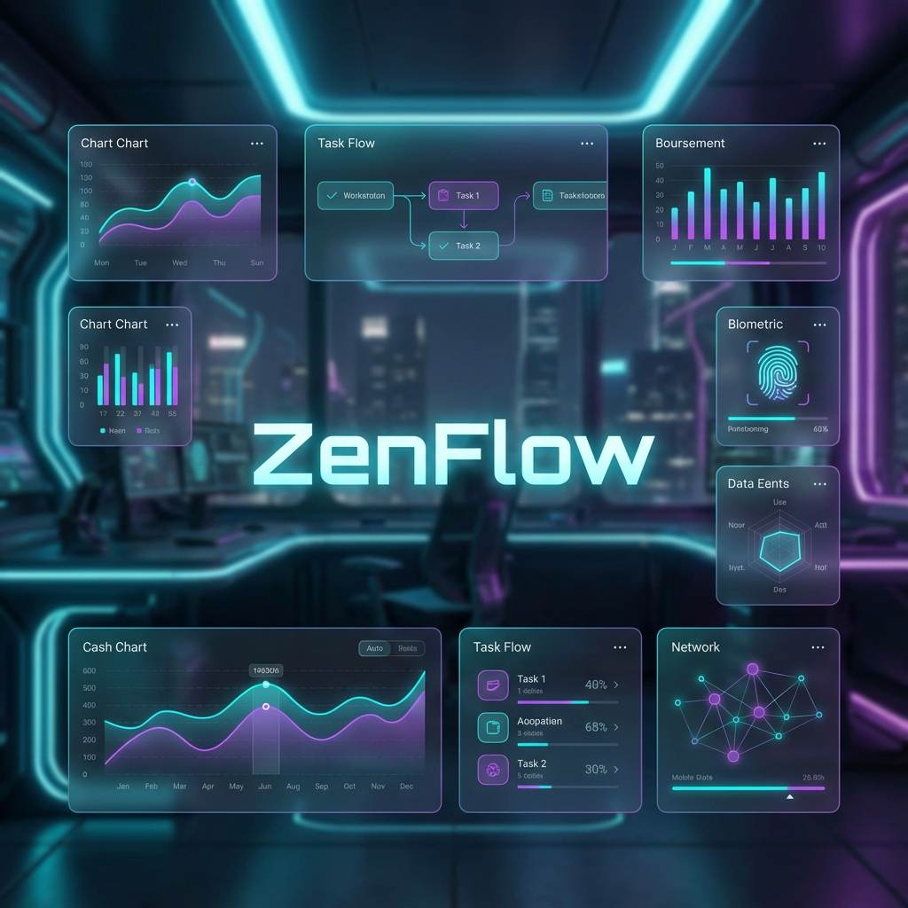

# 🌊 ZenFlow: The Apex Presence Guardian

### *Master your focus. Reclaim your time. Flow like water.*



[](LICENSE)
[](https://github.com/Yash-007688/zenflow/stargazers)
[](https://python.org)
[](https://vitejs.dev)

---

## 🚀 The Vision
**ZenFlow** isn't just a timer; it's an intelligent desk-guardian. By combining high-speed computer vision with a sleek cyberpunk dashboard, ZenFlow autonomously tracks your study sessions, logs your breaks (partial logs), and ensures you're always in the flow.

## 🛠️ Tech Stack
| Backend | Frontend | Styling |
| :--- | :--- | :--- |
|  |  |  |
|  |  |  |
|  |  |  |

---

## 🔥 Features
- **⚡ Zero-Lag Detection**: Powered by OpenCV Haar Cascades for lightning-fast face recognition.
- **🏢 Professional Punch-In**: Automatic "Permanent Log On" on startup—just like a high-end corporate system.
- **📉 Micro-Break Analysis**: Automatically detects when you leave your desk for 5+ minutes and logs it as a partial away session.
- **🎨 Cyberpunk UI**: A data-rich, neon-lit dashboard with glassmorphism and smooth animations.

---

## 🕹️ How to Use

1.  **Launch the Core**: Start the Python backend. It immediately "punches you in" and starts monitoring your desk.
2.  **Monitor the Hub**: Refresh your React dashboard to see your live status.
3.  **Flow Naturally**: Go for a water break or a snack. ZenFlow detects your absence and creates a "Partial Log" the moment you return.
4.  **Shift End**: When you're done for the day, hit the high-contrast **LOG OFF** button to finalize your daily record.

---

## 📥 Setup Instructions

### 1. Backend Installation
```bash
cd backend
pip install -r requirements.txt
python server.py
```

### 2. Dashboard Installation
```bash
cd frontend
npm install
npm run dev
```

---

## 🤝 Contributing
Contributions make the open-source community an amazing place to learn, inspire, and create.
1. Fork the Project
2. Create your Feature Branch (`git checkout -b feature/AmazingFeature`)
3. Commit your Changes (`git commit -m 'Add some AmazingFeature'`)
4. Push to the Branch (`git push origin feature/AmazingFeature`)
5. Open a Pull Request

---

## 📧 Contact & License
**Developer**: Yash Kumar Moolchandani 
**Project Link**: [https://github.com/Yash-007688/zenflow](https://github.com/Yash-007688/zenflow)

Distributed under the **MIT License**. See `LICENSE` for more information.

---
<p align="center">
  <i>Stay Focused. Stay Zen.</i>
</p>
